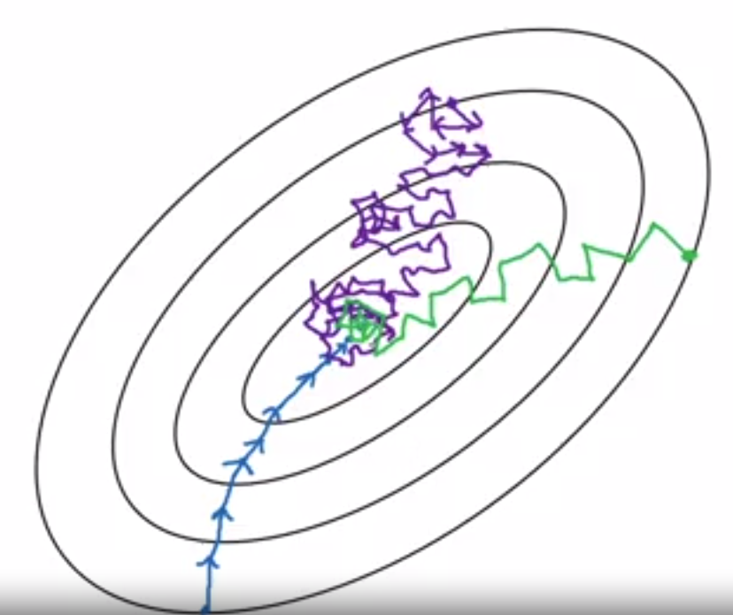

# Math_AI_prepration

## 1. Loss function:
___
### Classificaiton problem:

Cross entropy or Hinge loss

#### Entropy 

)

tell you how many bits you need to tranmit the messeges

#### cross-entropy

=-\sum&space;_{i}{p_{i}}log{_2}({q_i}))

p: actual probability

q: predicted probability

when p = q, the cross entropy has its minimum. It penalize the prediction that is highly confident but inaccurate.

For example, if one example belong to class 1, then the actually probability of class one is 1, class two is 0,
then the cross entropy will be -1log(1)+-0log(0) 
log(1) is zero and log(0) is -Inf, therefore, the cross entropy is 0

but on the other hand, if the classifier predict it is clas two while the true label is class one
the cross entropy will be Inf

    def cross_entropy(X,y):
      """
      X is the output from fully connect layer (shape with n_example, n_classes)
      y is labels (n_example, 1)
      """
      m = y.shape[0]
      p = softmax(X)
      log_likelihood = -np.log(p[range(m), y])
      loss = np.sum(log_likelihood)/m

      return loss

For unbalanced classes, can use Focal Loss:
&space;=&space;-\alpha_{t}(1-p{_t}){^{_{}}\gamma}&space;log(p{_t}))

#### Kullback-Leibler divergence (relative entropy)

In simplified terms, it is a measure of the distrance of two distributions. One appication of KL divergence is the famous generative adversarial network (GAN). KL divergence from distribution Q to P:

From above, you can see that KL divergence = Entropy - Cross Entropy
When the Entropy is constant, we only need to minimize the cross entropy in order to maxified the KL divergence. Why do we want a large KL divergence? When the difference is large, it is easier to seperate the two classes!

KL divergence is not symmetric, meaning, D(P||Q) is not equal to D(Q||P). 

 [Example:](https://www.youtube.com/watch?v=LJwtEaP2xKA) KL Divergence in this example can be understand as the number of extra bits needed in avarage to transmit a value drawn from distribution P when we use a code that was designed for another distribution Q? Note that in this example, the frequence was set as 1/2 or 1/4. In reality, it doesn't need to be two to the power of n, which means the KL divergence is the lower bound of the extra average length to transmit data. When P is the same as Q, then obviously, this increase is 0.

[Mutual information](https://www.youtube.com/watch?v=ZKyNGIXH6GQ) using KL-divergence: I(X;Y)=KL(p(x,y)||p(x)p(y)), x and y are two indepedent variables. 
Minimizing mutual information is equal to maximizing the KL-divergence.

#### Hinge loss

Hinge loss all penalize those that are correct but not confident

))

Hinge loss is faster to train in gradient descent than cross entropy - real time desicion making

If accuracy is more important, use cross entropy

### Regression:
MSE, MAE or Huber loss

MAE (L1 loss), is more robust to outliers than MSE

Huber loss, even more robust to outliers

## 2. Optimization
### Algorithm
1.Gradient descent family

(1) fixed learning rate

  
 
a. Blue: Batch gradient descent (vanilla) - update the whole training example in one iteration. It can take a long time for one iteration. When less than 2000 examples, use a.

b. Purple: Stochastic gradient descent - update one training example in one iteration. It can be slow due to the loss of the advantage of vectorization. 

c. Green: Minibatch gradient descent - update one batch/ several examples in one iteration/epoch, it runs much faster than a. for a large dataset. Tips: when choosing the batch size, 2^n usually have been computational efficiency. It is the most commonly used among the three. Typical values of the batch size: 64, 128, 256 and 512. Make sure one batch fits into the GPU memorgy.

(2) adaptive learning rate

Before going into details, we need to first understand two concepts: exponentially weighted averages and bias correction. 

a. exponentially weighted averages:

\Theta&space;{_t}), where  is the calculated average at time point t, and  is the actual number at time point t. When , it can be understand as averaging every 10 timesteps. When , it can be understand as averaging everying 50 timesteps as .

Note that:

 and 

### Practical tricks

#### History of CNN

1. LeNet: 
Use conV net (shared weight)

2. AlexNet:
ReLU, dropout, Data augmentation

3. VGG-16/19
Stage-wise training - requried Xavier/MSRA initation

4. GoogleNet
Multiple branches, shortcuts, bottleneck

Use Batch Norm

5. ImageNet
Deep residual learning
1x1 conv
has lower time complexity than VGG-16/19

